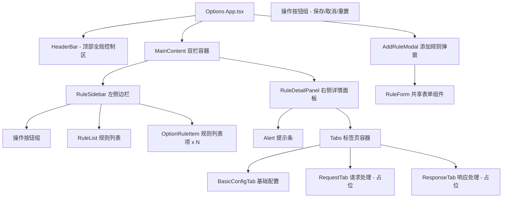

## Product Overview

在 Options 页面实现完整的 API 拦截与重定向规则管理功能，基于用户提供的 HTML 设计稿，使用项目现有的 React + Ant Design + Tailwind CSS 技术栈进行复刻与增强。采用左侧规则列表 + 右侧详情面板的双栏布局模式。

## Core Features

### 1. 顶部 Header 区域

- 渐变背景头部栏，包含标题"API 拦截与代理管理"、副标题说明文字
- 右侧全局拦截开关（Switch 组件），控制所有规则的生效状态
- 运行状态标签显示（运行中/已暂停）

### 2. 左侧边栏 - 规则列表区域

- 标题"拦截规则"，展示当前规则总数
- 操作按钮组：添加规则按钮、导入规则、导出规则
- 规则列表：每条规则显示匹配 URL、目标地址、启用状态指示器
- 规则项操作：启用/禁用 Switch 切换、编辑按钮、删除确认（Popconfirm）
- 点击规则项高亮选中状态（active），同步更新右侧详情面板
- 空状态提示（暂无规则时）

### 3. 右侧详情面板 - 规则配置区域

- 警告提示条：说明全局开关控制所有规则生效状态
- **基础配置标签页**：规则名称、拦截类型选择器（仅重定向可用，代理预留占位）、匹配模式（matchUrl）、目标地址（redirectUrl）、启用此规则开关
- **请求处理标签页**：预留结构，当前仅展示"重定向模式下无法修改请求内容"的提示信息
- **响应处理标签页**：预留结构，当前仅展示"重定向模式下无法修改响应内容"的提示信息
- 底部操作按钮组：保存规则、取消修改、重置为默认值

### 4. 添加/编辑规则模态框 (Modal)

- 支持新增和编辑两种模式
- 表单字段：规则名称、拦截类型（重定向/代理-禁用态）、匹配模式、目标地址
- 表单验证：必填字段校验 + URL 格式校验
- 确认后调用 RuleService 添加或更新规则

### 5. 导入/导出功能

- 导入：支持 JSON 文件导入规则批量添加
- 导出：将当前所有规则导出为 JSON 文件下载

### 6. 关键约束

- 重定向与代理逻辑完全解耦，本次只迁移重定向功能
- 代理相关的 UI 元素保留但置灰/禁用，标注"即将上线"
- 复用现有 shared 组件（RuleService、StorageService、useStorageState 等）
- 界面风格与 SidePanel 保持统一（Ant Design compact 主题 + Tailwind CSS）

## Tech Stack

| 类别 | 技术 | 版本 |
| --- | --- | --- |
| 框架 | React | 19.2.4 |
| UI 组件库 | Ant Design (antd) | 6.3.4 |
| 图标库 | @ant-design/icons | 6.1.1 |
| CSS 方案 | Tailwind CSS v4 | 4.2.2 |
| 语言 | TypeScript | 6.0.2 |
| 构建工具 | Vite + @crxjs/vite-plugin | 8.0 / 2.4 |


## Implementation Approach

### 整体策略

将 Options 页面构建为一个功能完整的规则管理中心，采用**双栏布局架构**：左侧为可操作的规则列表侧边栏，右侧为选中规则的详情编辑面板。核心设计原则：

1. **复用优先**：直接复用 `RuleService`、`useStorageState`、`StorageService` 等现有共享模块
2. **组件化拆分**：Options 页面较复杂（双栏 + 多标签页），需拆分为子组件保持可维护性
3. **渐进式扩展**：代理模式相关标签页内容预留占位但禁用交互，确保后续扩展时不破坏现有逻辑
4. **状态管理**：使用 React useState 管理选中规则 ID、当前激活标签页、表单编辑状态等页面级状态；通过 useStorageState 订阅全局存储变化

### 关键技术决策

1. **布局方案**：使用 Tailwind CSS 的 `grid grid-cols-[320px_1fr]` 实现左侧固定宽度 + 右侧自适应的双栏布局，替代原 HTML 中的 `grid-template-columns: 1fr 2fr`
2. **规则选中机制**：维护 `selectedRuleId` 状态，点击左侧规则项时更新选中态并填充右侧详情面板的表单数据；未选中时右侧显示空状态引导
3. **表单编辑策略**：右侧详情面板使用 Ant Design Form 组件管理编辑状态，切换选中规则时自动 `setFieldsValue` 填充数据；保存时调用 `RuleService.updateRule()`
4. **Modal vs 内联编辑**：添加新规则使用 Modal 弹窗（复用 RuleForm 组件）；编辑规则可在右侧详情面板内联编辑（更符合双栏布局的交互直觉）
5. **标签页隔离**：使用 Ant Design Tabs 组件实现基础配置/请求处理/响应处理的切换，请求和响应标签页在重定向模式下展示 Alert 提示而非真实编辑器

### 数据流

```
用户操作 (点击/输入/切换)
  -> React State 更新 (selectedRuleId / formData / activeTab)
    -> 调用 RuleService CRUD 方法
      -> StorageService 写入 chrome.storage.local
        -> background 监听 storage.onChanged -> 重建 DNR 动态规则
        <- useStorageState 监听 onChanged -> 自动刷新规则列表
```

### 性能与可靠性考量

- **无性能瓶颈**：规则数量上限 100 条（DNR 限制），前端渲染无压力
- **防竞态**：RuleService 所有方法均为 async，串行写 storage；background 端已有 scheduleApply 串行队列
- **错误边界**：所有 async 操作 try-catch 包裹，通过 Ant Design message 反馈错误信息
- **向后兼容**：不修改任何现有共享组件的类型定义或接口，仅新增 Options 页面代码

## Architecture Design

### 组件层级结构



## Directory Structure

```
src/
├── options/
│   ├── index.html              # [EXISTING] HTML 入口模板，无需修改
│   ├── main.tsx                # [EXISTING] React 入口 + AntD ConfigProvider，无需修改
│   ├── App.tsx                 # [MODIFY] 核心改造：从空壳变为完整 Options 页面主组件
│   └── components/             # [NEW] Options 页面子组件目录
│       ├── HeaderBar.tsx       # [NEW] 顶部 Header 区域：渐变背景 + 标题 + 全局开关 + 运行状态
│       ├── RuleSidebar.tsx     # [NEW] 左侧边栏：标题 + 按钮(添加/导入/导出) + 规则列表
│       ├── OptionRuleItem.tsx  # [NEW] Options 专用的规则列表项：选中高亮 + 信息摘要 + 操作按钮
│       ├── RuleDetailPanel.tsx # [NEW] 右侧详情面板：Alert 提示 + Tabs 标签页 + 底部操作按钮
│       ├── BasicConfigTab.tsx  # [NEW] 基础配置标签页：名称/类型/匹配URL/目标URL/启用开关
│       └── AddRuleModal.tsx    # [NEW] 添加规则 Modal：复用 RuleForm + 类型选择
├── shared/                     # [NO MODIFY] 全部复用现有代码
│   ├── components/RuleForm.tsx
│   ├── components/RuleItem.tsx
│   ├── hooks/useStorageState.ts
│   ├── services/ruleService.ts
│   └── services/storageService.ts
├── types/index.ts              # [NO MODIFY] 现有类型定义
└── utils/index.ts              # [NO MODIFY] getErrorMessage 工具函数
```

## Key Code Structures

### OptionRuleItem 组件 Props（Options 专用规则列表项）

```typescript
interface OptionRuleItemProps {
  rule: RuleConfig;
  isActive: boolean;           // 是否被选中（高亮态）
  onSelect: (rule: RuleConfig) => void;  // 点击选中回调
  onEdit: (rule: RuleConfig) => void;    // 编辑回调（打开 Modal 或切换到编辑态）
  onDelete: (rule: RuleConfig) => void;  // 删除回调
  onToggle: (rule: RuleConfig, enabled: boolean) => void;  // 启用/禁用切换
}
```

### RuleDetailPanel 组件 Props（右侧详情面板）

```typescript
interface RuleDetailPanelProps {
  rule: RuleConfig | undefined;      // 当前选中的规则，undefined 显示空状态
  onUpdate: (rule: RuleConfig) => void;  // 保存更新回调
}
```

## 设计风格概述

采用现代企业级工具类产品的设计风格，以 Ant Design 为基础组件体系，结合 Tailwind CSS 实现精细布局控制。整体视觉语言参考用户提供的 HTML 原型设计，但在组件层面完全使用 Ant Design 原生组件替换自定义 HTML/CSS 实现。设计强调清晰的信息层次、高效的操作效率和专业的技术产品质感。

## 页面规划

### 页面 1: Options 主页面（唯一页面）

#### Block 1: HeaderBar 顶部导航区

全宽渐变背景顶栏，左侧展示产品品牌标识（标题 + 描述副标题），右侧放置全局控制元素（全局拦截 Switch 开关 + 运行状态 Tag 标签）。渐变色采用紫蓝渐变（#667eea → #764ba2）呼应原型设计，白色文字保证对比度。高度约 72px，内部使用 Flexbox 两端对齐布局。

#### Block 2: RuleSidebar 左侧规则列表栏

固定宽度 320px 的左侧边栏，白色卡片底色带轻微阴影。顶部为区块标题"拦截规则"及规则计数统计。紧接着是横向排列的操作按钮组（添加规则 primary 按钮、导入 default 按钮、导出 default 按钮）。下方是可滚动的规则列表区域，每条规则以卡片形式呈现：包含规则匹配 URL 文本（截断溢出）、目标地址文本（次要色）、底部操作行（Switch 启停 + Edit 图标按钮 + Delete 危险按钮）。选中态使用主题蓝色边框 + 浅蓝背景高亮。空状态时居中展示 Empty 占位组件。

#### Block 3: RuleDetailPanel 右侧规则详情面板

自适应宽度右侧面板，白色卡片底色带轻微阴影。顶部为区块标题"规则详情"。紧随其后是 Alert 警告提示条（warning 类型），说明全局开关的控制作用。主体区域为 Ant Design Tabs 标签页组件，包含三个 Tab："基础配置"、"请求处理"、"响应处理"。基础配置 Tab 展示完整表单：规则名称 Input、拦截类型 Select（仅重定向可选）、匹配模式 Input(prefix 图标)、目标地址 Input(prefix 图标)、启用 Checkbox。请求处理和响应处理 Tab 在当前版本中展示 Alert 提示信息，告知用户该功能在重定向模式下不可用。面板底部固定操作按钮行：保存(primary)、取消(default)、重置(default)。

#### Block 4: AddRuleModal 添加规则弹窗

模态框覆盖层，宽度 520px。标题根据新建/编辑模式动态变化。内容区域嵌入 RuleForm 共享表单组件（matchUrl + redirectUrl 字段）+ 额外的规则名称字段 + 拦截类型选择器。底部操作按钮：确认(primary) + 取消(default)。表单验证失败时滚动到首个错误字段并聚焦。

## Agent Extensions

### SubAgent

- **code-explorer**
- Purpose: 在实现过程中深入探索具体文件的代码细节，确保对现有组件接口、类型定义、服务方法的精确理解
- Expected outcome: 准确获取每个需要复用的共享组件的 Props 接口、方法签名和返回类型，避免因接口不匹配导致的编译错误